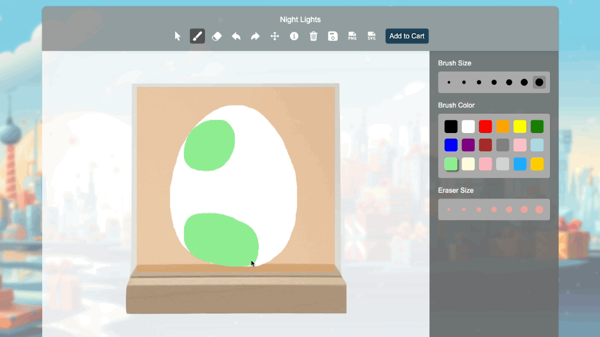
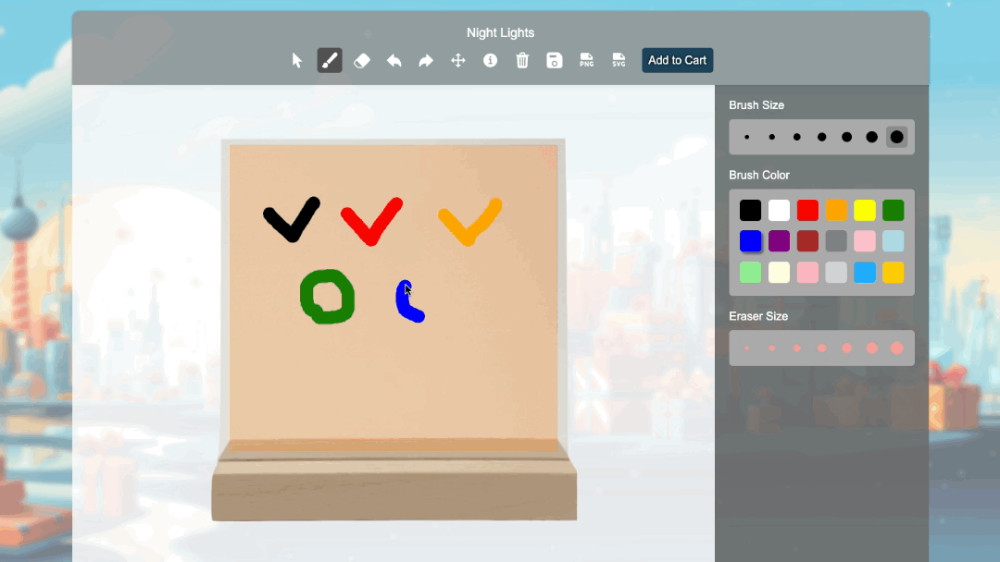
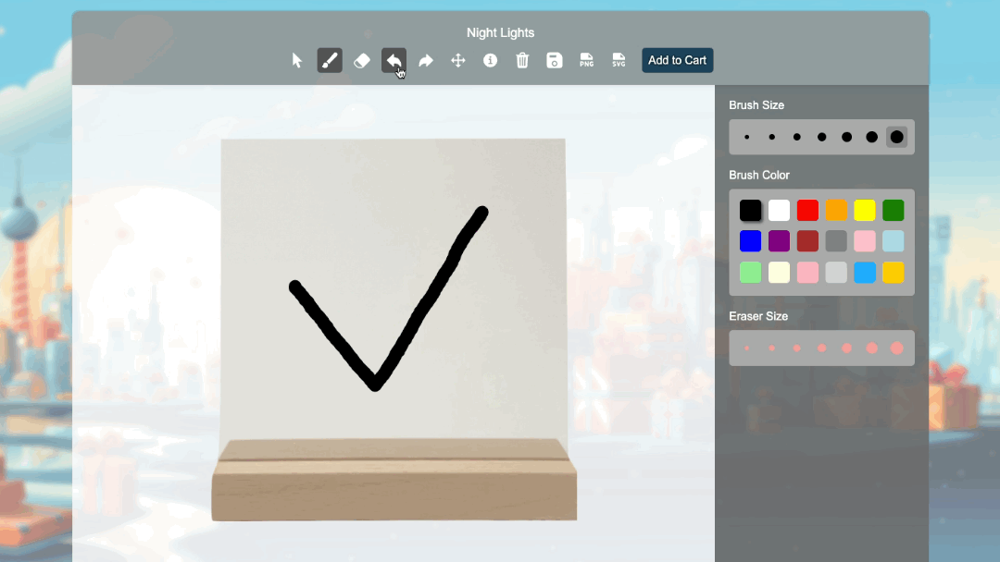
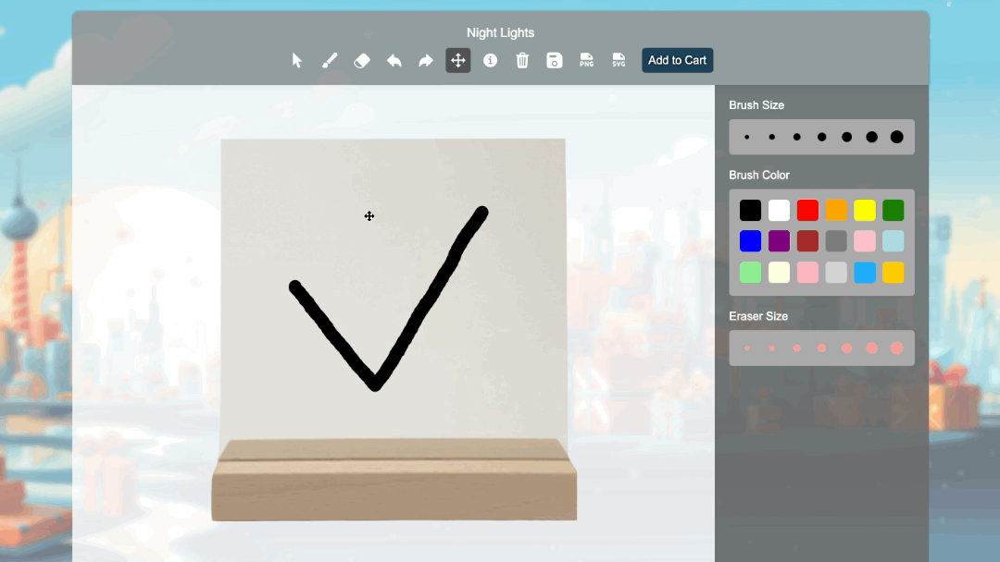
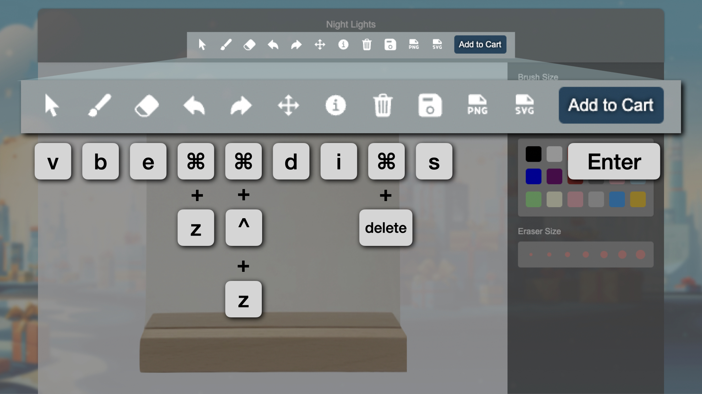
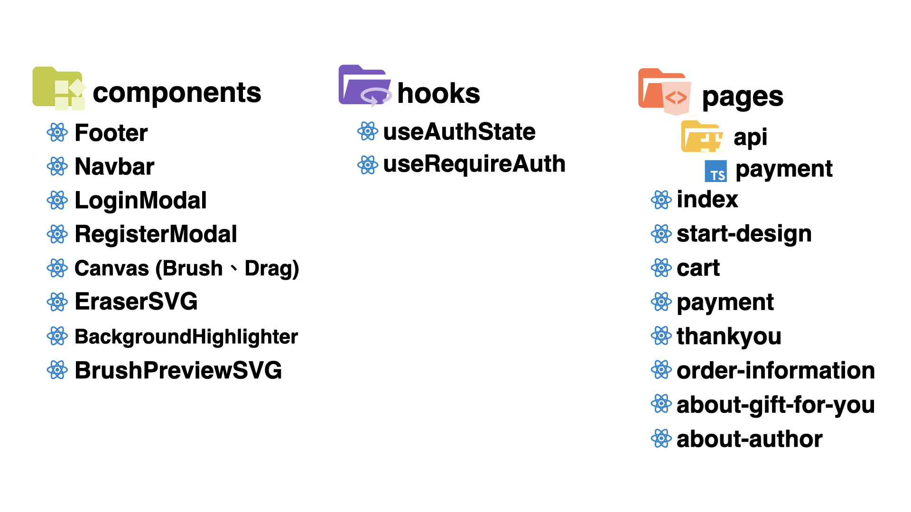
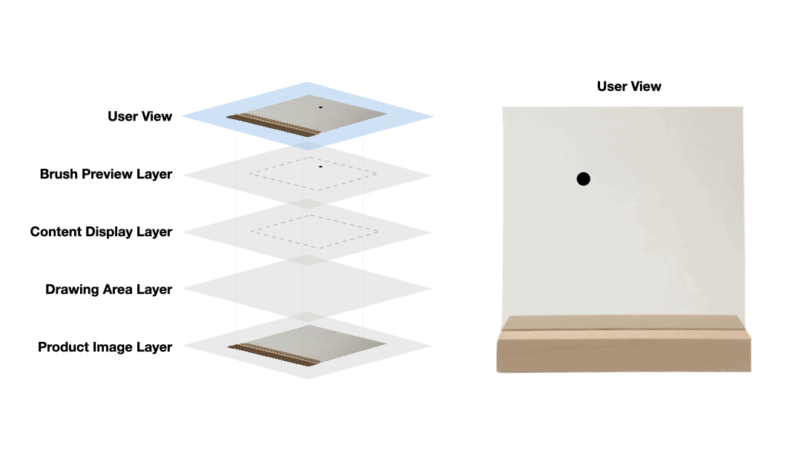
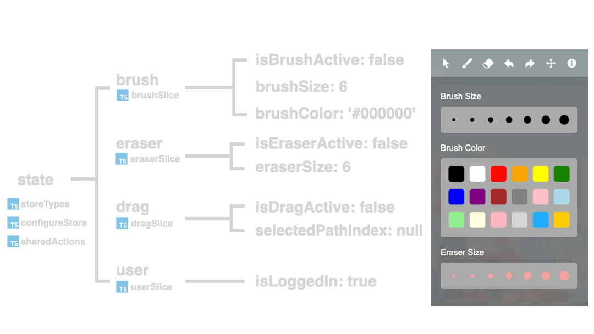
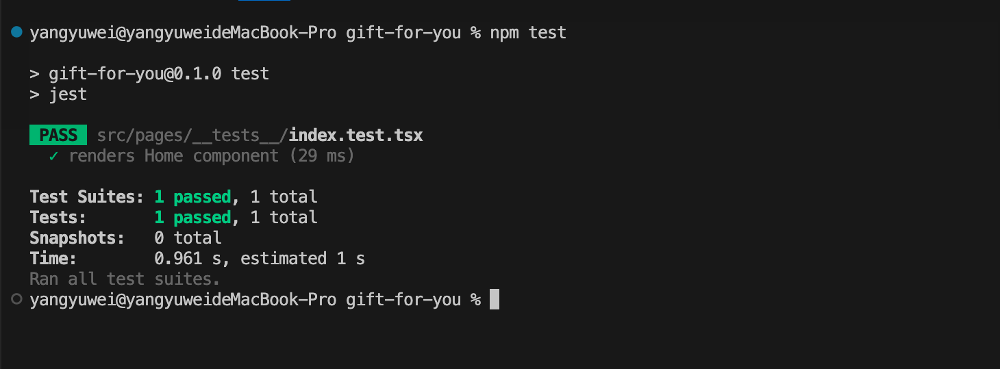

### Gift For You

"Gift For You" is a website for customizing gift items. It offers a canvas for users to design product patterns online and enables them to instantly preview the design results on the products."

Website：https://gift-for-you-2023.vercel.app/

### Technology Stack

- **React**：`useEffect`, `useState`, `useCallback`
- **Custom Hooks**：`useAuthState`, `useRequireAuth`
- **Redux**：`useSelector`, `useDispatch`
- **Redux Toolkit**：`createSlice`, `createAction`
- **Next.js**：App Router
- **TypeScript**
- **ESLint**
- **Jest**：Integration Tests
- **Self-Built WYSIWYG Canvas Editor**
- **Firebase**：Cloud Firestore, Storage, Authentication
- **Vercel**
<!-- 補圖-->

### RWD：300 px ~ 2000 px

### Complete Process
<!-- 待補 GIF 動畫圖-->

### Canvas Editor
#### (１) Brush

#### (２) Eraser

#### (３) Undo & Redo

#### (４) Drag

#### (５) React Hotkeys Hook

| Name             | Function                    | Keyboard Shortcuts                |
|------------------|-----------------------------|-----------------------------------|
| Cursor           | Switch to cursor mode       | `v`                               |
| Brush            | Switch to brush tool        | `b`                               |
| Eraser           | Switch to eraser tool       | `e`                               |
| Undo             | Undo the last action        | `meta+z`, `ctrl+z`                |
| Redo             | Redo the last undone action | `meta+shift+z`, `ctrl+shift+z`    |
| Drag             | Switch to drag tool         | `d`                               |
| Product Details  | Display product details     | `i`                               |
| Clear Canvas     | Clear the canvas content    | `meta+delete`, `ctrl+delete`      |
| Save Canvas      | Save to Firebase            | `s`                               |
| Add to Cart      | Add canvas to shopping cart | `Enter`                           |

### Supplementary Features

#### (１) Member System (Login & Logout)

#### (２) Shopping Cart

#### (３) Third-Party Payment (Tappay)

#### (３) Order History

### Component Strusture

### Custom Hooks

#### (１) useAuthState
The useAuthState hook is designed for managing user authentication states in a React application. It leverages Firebase's authentication service to listen for changes in the user's authentication status.

#### (２) useRequireAuth
The useRequireAuth hook is utilized to manage access control in React components, particularly when certain user interactions require the user to be authenticated (logged in).

### Canvas Structure Diagram

### Redux Toolkit
  

### Jest
#### (１) Integration Tests

