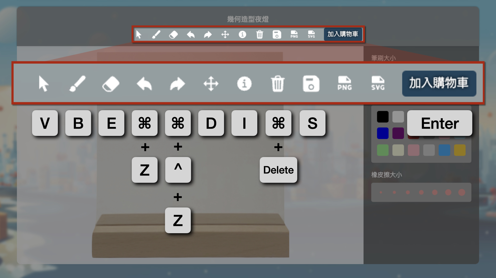
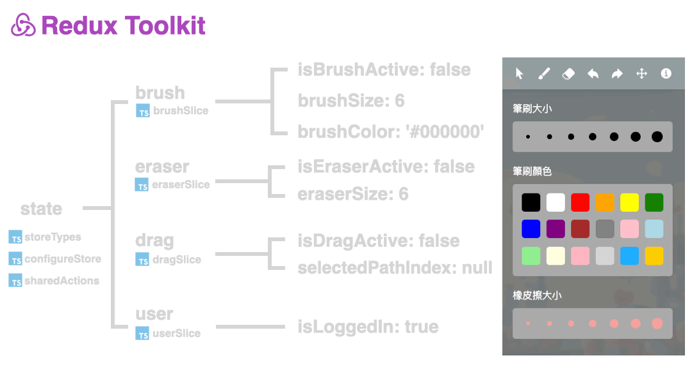

### 禮品訂製所 Gift For You

禮品訂製所是一個禮贈品客製化的設計網站，提供畫布讓使用者線上設計產品圖案，並且能夠即時預覽設計成果在產品上。

網站連結：https://gift-for-you-2023.vercel.app/

### 技術堆疊

- **React**：`useEffect`, `useState`, `useCallback`
- **Custom Hooks**：`useAuthState`, `useRequireAuth`
- **Redux**：`useSelector`, `useDispatch`
- **Redux Toolkit**：`createSlice`, `createAction`
- **Next.js**：App Router
- **TypeScript**
- **ESLint**
- **Self-Built WYSIWYG Canvas Editor**
- **Firebase**：Cloud Firestore, Storage, Authentication
- **Vercel**
<!-- 補圖-->

### RWD：300 px ~ 2000 px

### 完整流程
<!-- 待補 GIF 動畫圖-->

### 畫布編輯器
#### (１) 畫筆
<!-- 待補 GIF 動畫圖-->

#### (２) 橡皮擦
<!-- 待補 GIF 動畫圖-->

#### (３) 上一步、下一步
<!-- 待補 GIF 動畫圖-->

#### (４) 拖移
<!-- 待補 GIF 動畫圖-->

#### (５) 鍵盤快捷鍵 React Hotkeys Hook

| 名稱             | 功能                     | 鍵盤快捷鍵                               |
|----------------|------------------------|------------------------------------|
| Cursor         | 切換游標功能             | `v`                                 |
| Brush          | 切換到畫筆工具           | `b`                                 |
| Eraser         | 切換到橡皮擦工具         | `e`                                 |
| Undo           | 撤銷上一個動作           | `meta+z`, `ctrl+z`                 |
| Redo           | 重做上一個被撤銷的動作   | `meta+shift+z`, `ctrl+shift+z`     |
| Drag           | 切換拖移工具             | `d`                                 |
| Product Details | 顯示產品詳情           | `i`                                 |
| Clear Canvas   | 清空畫布內容             | `meta+delete`, `ctrl+delete`       |
| Save Canvas    | 保存到 Firebase     | `s`                                 |
| Add to Cart    | 將畫布加入購物車         | `Enter`                             |

### 附屬功能
#### (１) 購物車
<!-- 待補 GIF 動畫圖-->

#### (２) 第三方支付 Tappay
<!-- 待補 GIF 動畫圖-->

### 組件架構
<!-- 待補：組件結構  -->

### 自定義 Hook

<!-- 待補：自定義 Hook 介紹  -->

### 畫布結構設計

### 狀態管理
  

